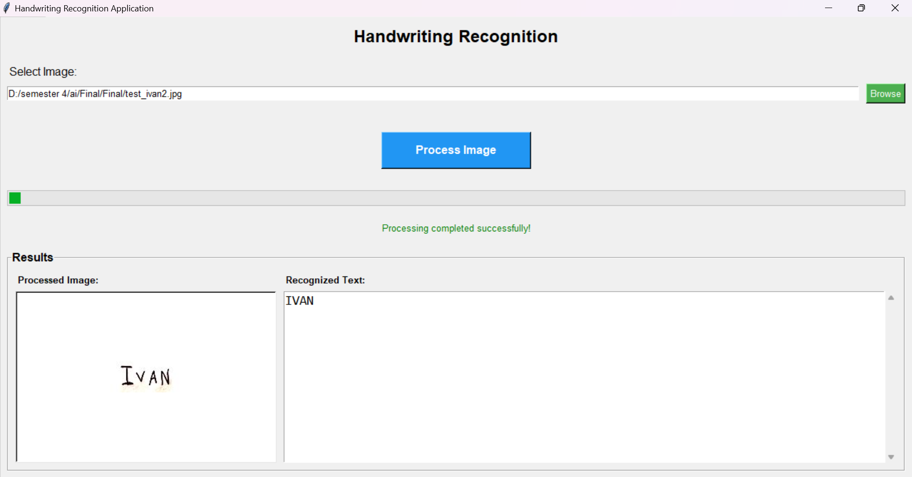

# OCR Image to Text Converter


A powerful OCR (Optical Character Recognition) tool that converts images containing handwritten or printed text into editable digital text. Built as part of an AI class project using deep learning techniques.

## ✨ Features

- **Image to Text Conversion**: Extract text from images
- **Multiple Format Support**: Works with various image formats (PNG, JPG, JPEG, etc.)
- **Handwritten Text Recognition**: Capable of recognizing handwritten text
- **Easy to Use**: Simple interface for quick conversions
- **Offline Processing**: No internet connection required

## 🚀 Quick Start

### Option 1: Download Executable (Recommended)

No Python installation required! Simply download and run:

**Download Links:**
- 🔗 [Bit.ly (Quick Link)](https://bit.ly/aiexe_drive)
- 📁 [Google Drive](https://drive.google.com/drive/u/6/folders/1uyTis5csoT9GumOYGdypHXQ64ZjvKp2p)

> **Note:** Windows Defender may show a warning for custom executables. This is normal - simply click "More info" → "Run anyway" to proceed safely.

### Option 2: Run from Source

#### Prerequisites

- Python 3.7 or higher
- pip package manager

#### Installation

1. **Clone the repository**
   ```bash
    https://github.com/kenziecarlen13/AI_project.git
   cd AI_project
   ```

2. **Install required dependencies**
   ```bash
   pip install opencv-python-headless numpy tensorflow keras pillow
   ```

3. **Run the application**
   ```python
   python main.py
   ```

## 📦 Dependencies

| Library | Purpose |
|---------|---------|
| `opencv-python-headless` | Image processing and computer vision |
| `numpy` | Numerical computations |
| `tensorflow` | Deep learning framework |
| `keras` | High-level neural network API |
| `pillow` | Python Imaging Library |

## 🔧 Usage

1. **Launch the application**
   - Run the executable or Python script
   
2. **Load an image**
   - Click "Browse" or drag & drop your image file
   - Supported formats: PNG, JPG, JPEG, BMP, TIFF
   
3. **Process the image**
   - Click "Convert to Text" button
   - Wait for the OCR processing to complete
   
4. **View and save results**
   - Review the extracted text
   - Copy to clipboard or save to file


## 🙏 Acknowledgments

- Built as part of an AI/ML class project
- Thanks to the open-source community for the amazing libraries
- Special thanks to our instructors for guidance and support


**Note**: This project was developed with lots of ☕, a few 😭 moments when the HDD decided to take breaks, but ultimately built with 💖 for the AI community!

> ⚠️ **Hardware Warning**: Training deep learning models can be intensive on your system. Make sure you have adequate cooling and storage space! 🧊


# P.S. Media Information

 <br>


